# Fit AI - Comprehensive Fitness Tracking Application

A full-featured fitness tracking application with workout logging, exercise library, goal setting, progress tracking, recovery monitoring, and an AI-powered coach.


## Screenshots

### Sign In & Sign Up

<p align="center">
  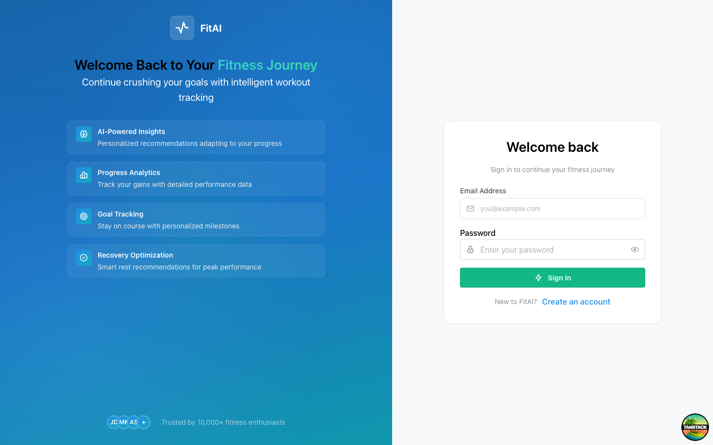
  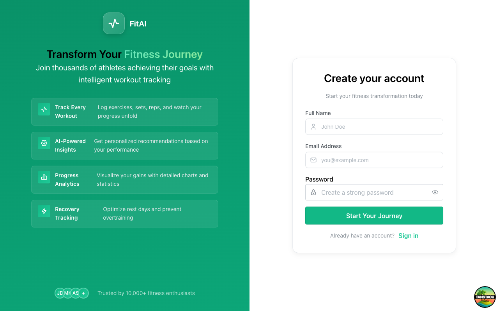
</p>

### Dashboard

<p align="center">
  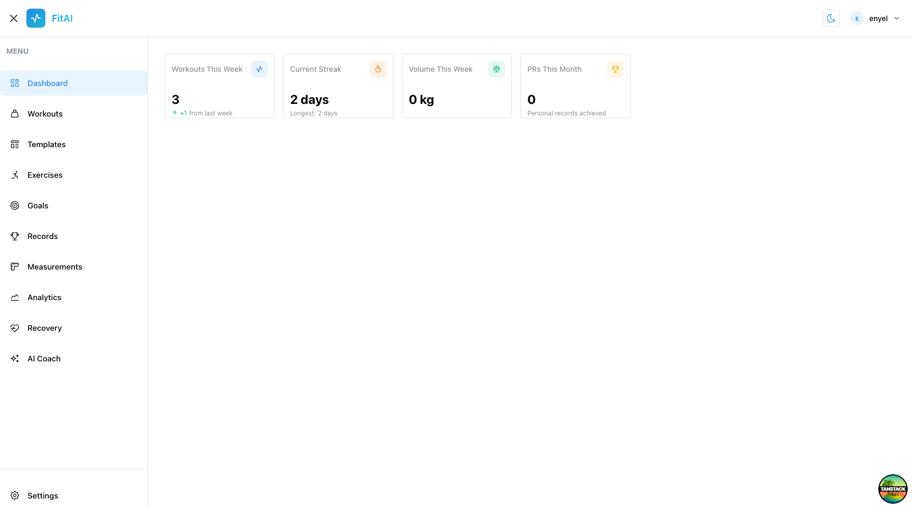
</p>

### Workouts

<p align="center">
  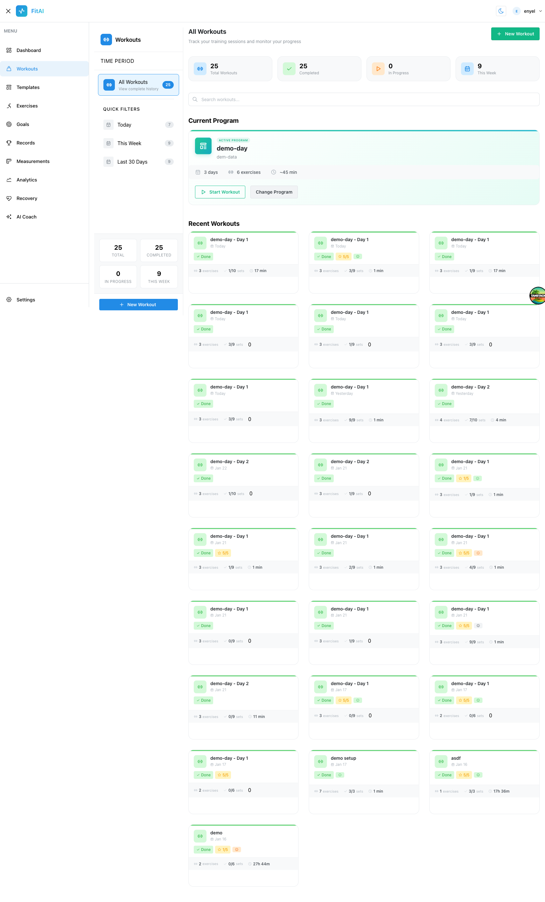
  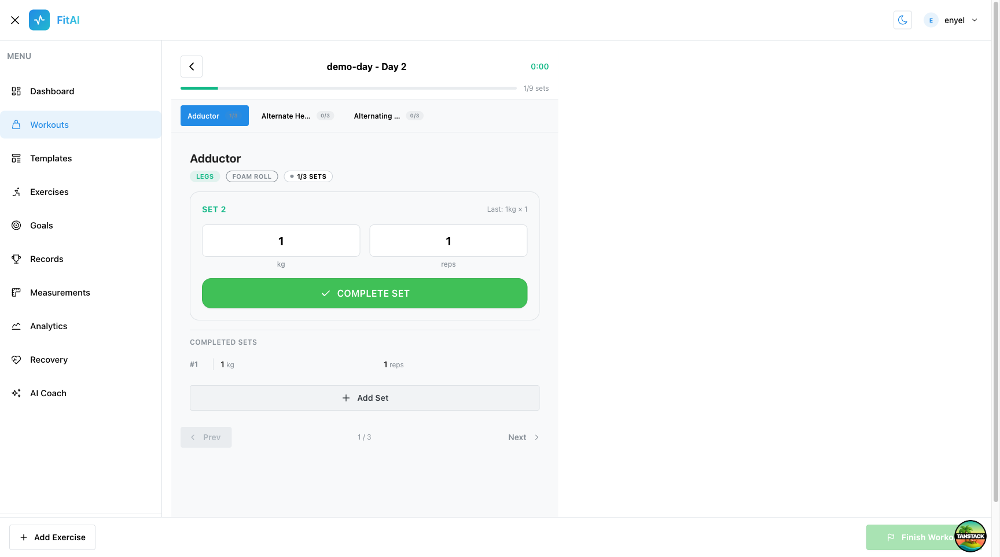
</p>

### Templates

<p align="center">
  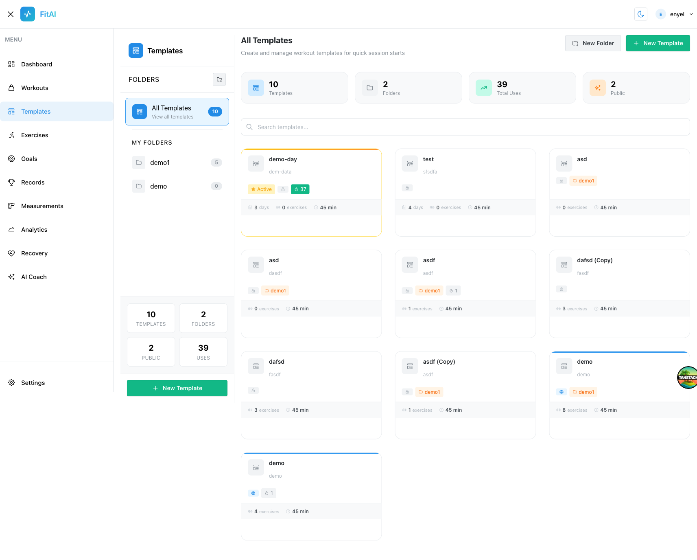
</p>

### Goals & Records

<p align="center">
  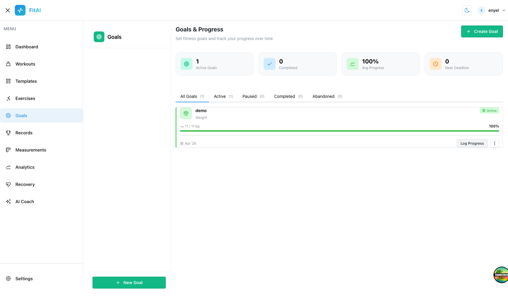
  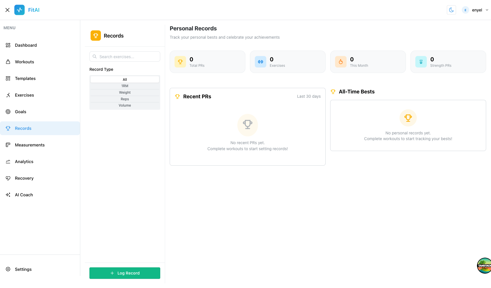
</p>

### Recovery

<p align="center">
  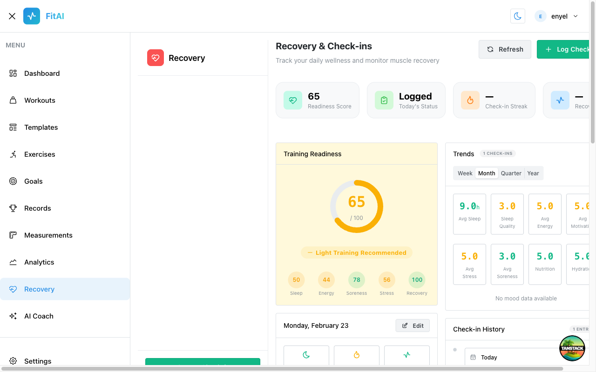
</p>

### AI Coach

<p align="center">
  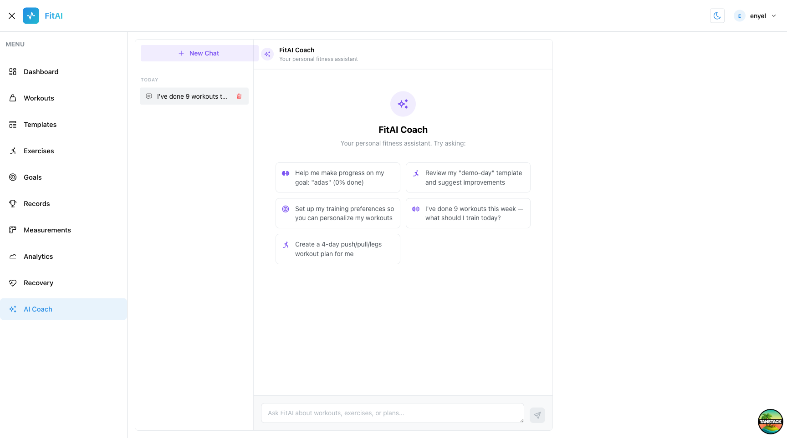
  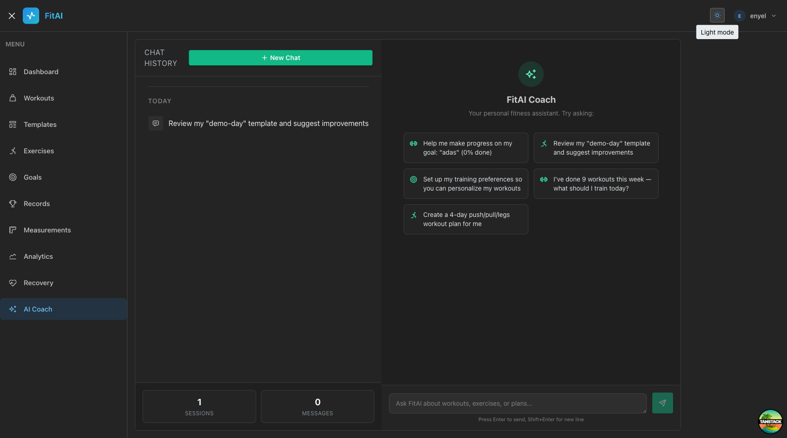
</p>

## Features

### Exercise Library
- **873+ exercises** from [Free Exercise DB](https://github.com/yuhonas/free-exercise-db) with images
- Categorized by muscle group (chest, back, shoulders, arms, legs, core)
- Detailed instructions, difficulty levels, and equipment requirements
- Create custom exercises
- Paginated browsing with search and filters

### Workout Tracking
- Log workouts with multiple exercises and sets
- Set types: normal, warmup, dropset, failure, rest-pause
- RPE (Rate of Perceived Exertion) and RIR (Reps in Reserve) tracking
- Superset support
- Workout templates for quick session starts
- Rest timer with progress tracking

### Goals System
- 5 goal types: weight, strength, body measurement, workout frequency, custom
- Progress tracking with history and visual indicators
- Goal status management (active, paused, completed, abandoned)

### Progress Tracking
- Body measurements tracking
- Progress photos with before/after comparison
- Personal records (PRs) detection and history
- Training analytics and volume/strength charts

### Recovery System
- Daily recovery check-ins (sleep, stress, soreness, energy, nutrition, hydration)
- Training readiness score calculation
- Trend analysis across week, month, quarter, and year
- Check-in history and streak tracking

### AI Coach
- Conversational AI fitness assistant powered by OpenRouter
- Context-aware suggested prompts based on your data
- Chat session history with persistence
- Workout plan generation, template reviews, and training recommendations

## Tech Stack

| Layer              | Technology                                           |
| ------------------ | ---------------------------------------------------- |
| **Frontend**       | React 19, TanStack Start/Router/Query, Mantine UI    |
| **Backend**        | Hono, oRPC (type-safe RPC)                           |
| **Database**       | Drizzle ORM, Cloudflare D1 (SQLite)                  |
| **Auth**           | better-auth with cookie sessions                     |
| **AI**             | TanStack AI, OpenRouter                              |
| **Infrastructure** | Cloudflare Workers, pnpm workspaces, Turborepo       |
| **Testing**        | Vitest (800+ tests)                                  |

## Project Structure

```
fit-ai/
├── apps/
│   ├── web/              # React frontend (TanStack Start + Vite)
│   └── server/           # Hono + oRPC API server (Cloudflare Workers)
├── packages/
│   ├── api/              # oRPC routers and business logic
│   ├── auth/             # Authentication (better-auth)
│   ├── db/               # Drizzle ORM schema and migrations
│   ├── env/              # Environment validation (@t3-oss/env)
│   └── infra/            # Cloudflare infrastructure (Alchemy)
├── docs/
│   └── images/           # Application screenshots
```

## Getting Started

### Prerequisites

- Node.js 20+
- pnpm 10+

### Installation

```bash
# Clone the repository
git clone https://github.com/enyelsequeira/fit-ai.git
cd fit-ai

# Install dependencies
pnpm install

# Set up environment variables
cp apps/server/.env.example apps/server/.env
cp apps/web/.env.example apps/web/.env
```

### Database Setup

```bash
# Push schema to local D1 database
pnpm db:push

# Seed exercises from Free Exercise DB (873+ exercises with images)
pnpm -F @fit-ai/db db:seed:free-exercise-db
```

### Development

```bash
# Start all apps in development mode
pnpm dev

# Or start individually
pnpm dev:web     # Frontend on http://localhost:3001
pnpm dev:server  # API on http://localhost:3000
```

### Testing

```bash
# Run all tests
pnpm test

# Type checking
pnpm check-types

# Linting
pnpm check
```

## Available Scripts

| Command            | Description                        |
| ------------------ | ---------------------------------- |
| `pnpm dev`         | Start all apps in development mode |
| `pnpm build`       | Build all applications             |
| `pnpm test`        | Run test suite                     |
| `pnpm check-types` | TypeScript type checking           |
| `pnpm check`       | Run Oxlint + Oxfmt                 |
| `pnpm db:push`     | Push schema to database            |
| `pnpm db:generate` | Generate migrations                |
| `pnpm deploy`      | Deploy to Cloudflare               |

## API

The API uses oRPC for type-safe endpoints with automatic OpenAPI spec generation.

**Documentation**: Available at `/docs` (Swagger UI) and `/reference` (Scalar) when running the server.

Key routers:
- `/rpc/exercise/*` - Exercise CRUD and listing
- `/rpc/workout/*` - Workout logging and management
- `/rpc/template/*` - Workout template management
- `/rpc/goals/*` - Goal setting and tracking
- `/rpc/recovery/*` - Recovery check-ins
- `/rpc/analytics/*` - Training analytics
- `/rpc/chatSession/*` - AI chat session management

## Deployment

This project deploys to Cloudflare Workers using Alchemy:

```bash
# Login to Cloudflare (first time)
pnpm wrangler login

# Deploy
pnpm deploy

# Seed remote database
pnpm -F @fit-ai/db db:seed:free-exercise-db:remote
```

## Contributing

Contributions are welcome! Please read the [AGENTS.md](./AGENTS.md) file for coding guidelines.

## License

MIT License - see [LICENSE](./LICENSE) for details.

## Acknowledgments

- [Free Exercise DB](https://github.com/yuhonas/free-exercise-db) for the exercise library (Public Domain)
- [Better-T-Stack](https://github.com/AmanVarshney01/create-better-t-stack) for the project scaffold
- [Mantine](https://mantine.dev/) for the UI component library
